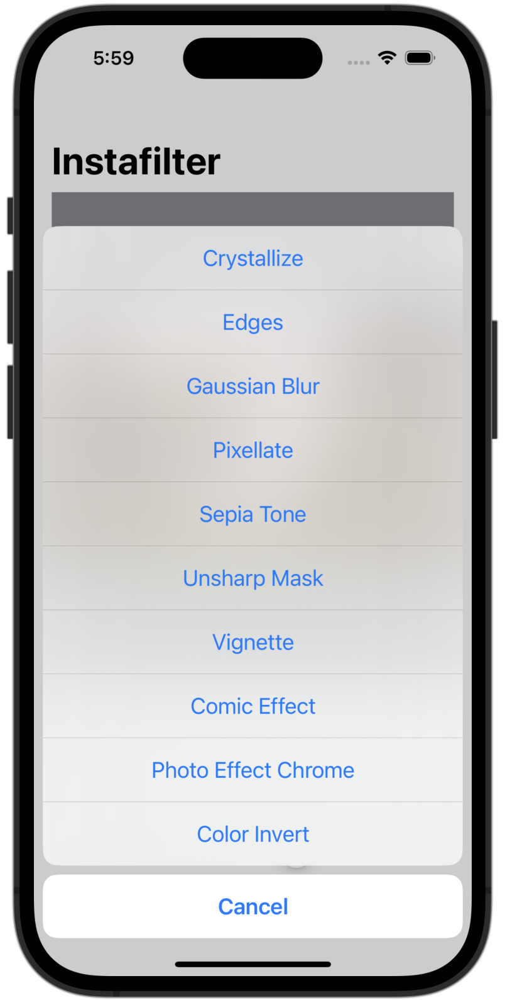

# Instafilter

A simple iOS app that allows people to import photos from their library and choose from a set of image effects to apply to them.

## Installing / Getting started

To run this project, you will need a Mac computer with the latest version of Xcode and an iOS 15 Simulator set up. Simply clone the respository, open the project in Xcode, and run the app to get it working.

## Features

## Credit

The idea for this project came from Paul Hudson's *100 Days of SwiftUI*. I may eventually add to this code, but credit for the base code goes to Paul Hudson. Links to each day on which material is referenced may be found below:

[Day 62 - Instafilter Part One](https://www.hackingwithswift.com/100/swiftui/62)

[Day 63 - Instafilter Part Two](https://www.hackingwithswift.com/100/swiftui/63)

[Day 64 - Instafilter Part Three](https://www.hackingwithswift.com/100/swiftui/64)

[Day 65 - Instafilter Part Four](https://www.hackingwithswift.com/100/swiftui/65)

[Day 66 - Instafilter Part Five](https://www.hackingwithswift.com/100/swiftui/66)

[Day 67 - Instafilter Part Six](https://www.hackingwithswift.com/100/swiftui/67)

## Screenshots

Screenshots will go here when they are ready.

<!--
-->
<!--    -->
<!--    -->
<!--
-->
